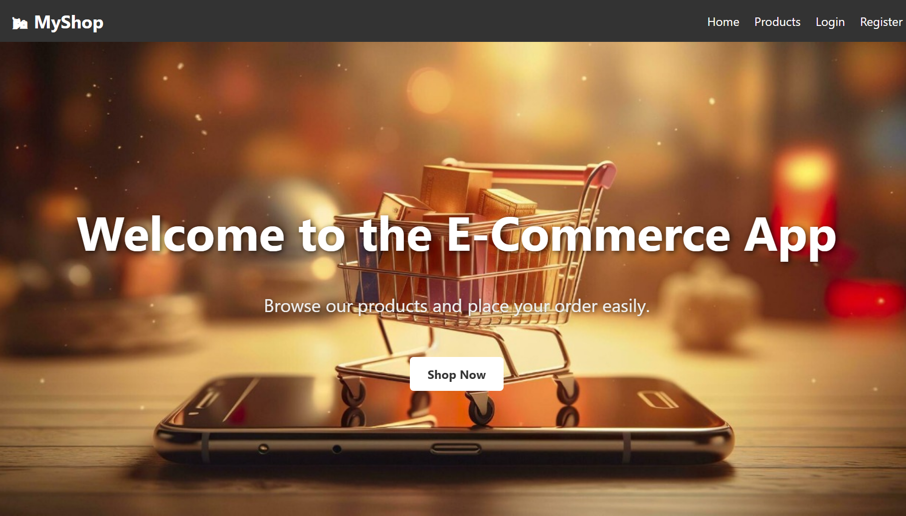
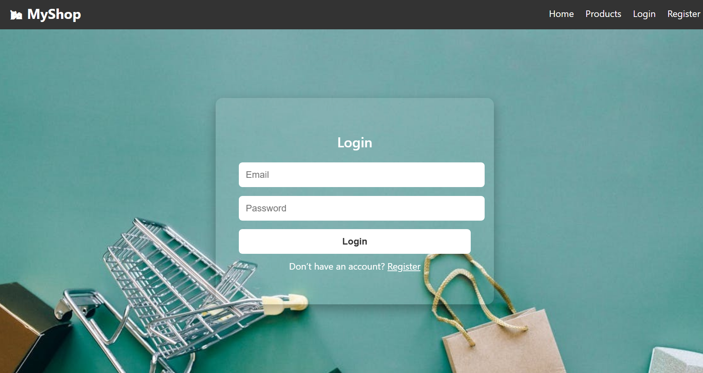
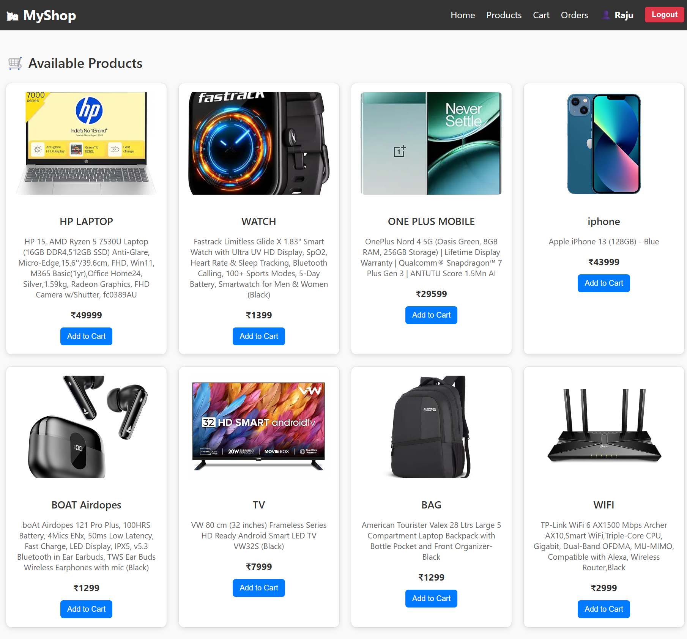
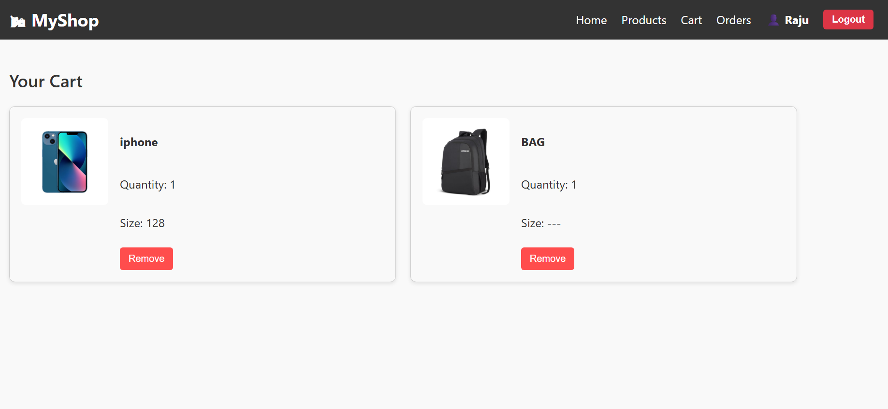
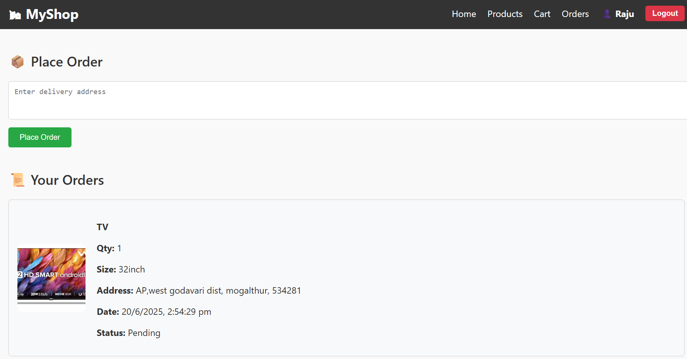
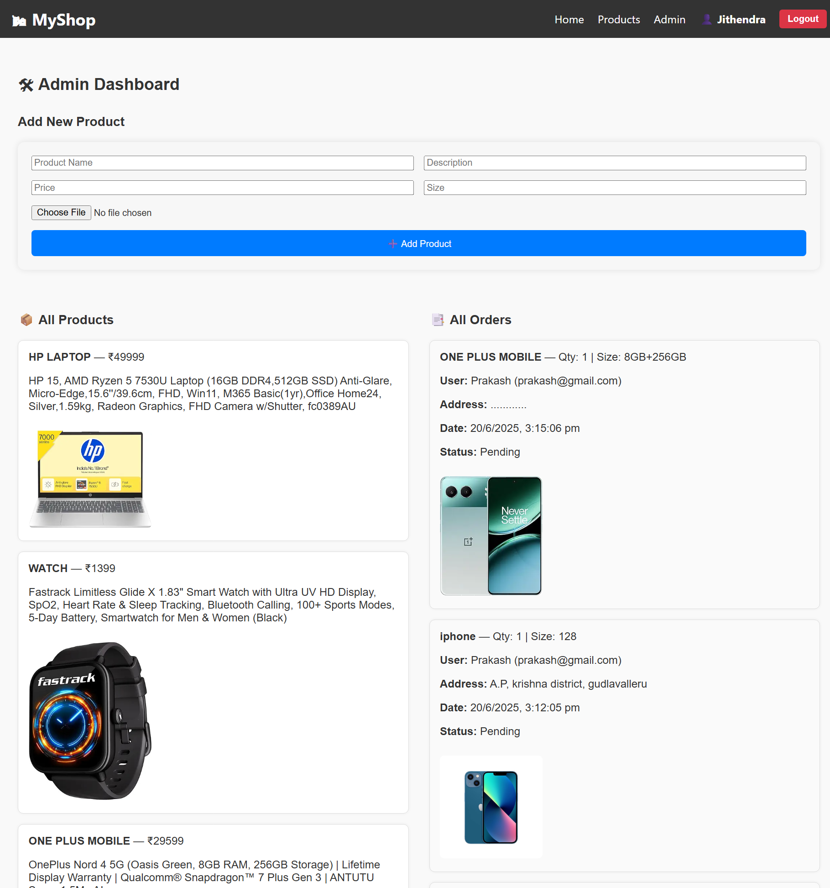

# 🛍 E-Commerce Website

A full-stack e-commerce web application built using **MERN stack** (MongoDB, Express, React, Node.js).  
It supports **user and admin roles**, with features like:

- User registration and login (with JWT)
- View products
- Add items to cart
- Place orders with address
- Admin panel to manage products and view all orders

---
# 📺VIDEO reference link

https://drive.google.com/file/d/1dhc1aAEXw9sfJuooIj0q8GPEKEItCQVG/view?usp=drivesdk

---

## 🚀 Tech Stack

- **Frontend**: React, Axios, CSS
- **Backend**: Node.js, Express
- **Database**: MongoDB
- **Authentication**: JWT + bcrypt

---

## 🖥️ Screenshots

### ✅ Home Page


### ✅ Login Page



### 🛒 Products Page


### 🧺 Cart Page


### 📦 Orders Page

### 🛠 Admin Dashboard


---

## ⚙️ Setup Instructions

1. Clone the repo
Install dependencies:

For frontend:
cd client
npm start


For backend:

cd ../server
node index.js

```bash
📦 Folder Structure
ecommerce_app/
│
├── client/          # React frontend
│   ├── public/
│   └── src/
│
├── server/          # Node.js + Express backend
│   ├── models/
│   ├── routes/
│   ├── controllers/
│   └── index.js

```

Password Hashing (Hash File)
In this project, we use bcryptjs to securely hash user passwords before storing them in the database. This is a critical security measure to protect user credentials even if the database is compromised.

✅ Use Case
If you're manually creating an admin user in the database (e.g., via MongoDB Compass or a seed script), you can:

Run the hash script.

Copy the generated hash.

Paste it as the password field in your database record.


✨ Author
Jithu I


